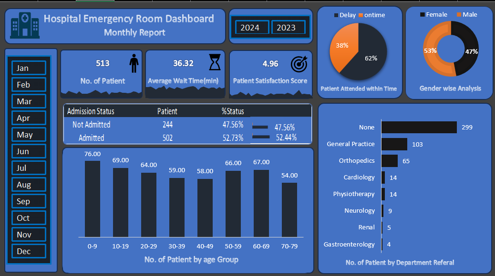

🏥 Hospital Emergency Room Dashboard (Microsoft Excel)

 Project Overview
This project is an Interactive Hospital Emergency Room Dashboard built in Microsoft Excel to analyze emergency room (ER) patient data and provide meaningful insights into hospital operations.
The dashboard enables users to monitor important healthcare KPIs, identify patient trends, evaluate operational efficiency, and support data-driven decision-making through interactive visualizations.

🎯 Project Objective

The primary objective of this project is to create an interactive Hospital Emergency Room Analysis Dashboard that improves operational visibility and provides actionable insights into Emergency Room performance.

The dashboard enables hospital administrators and stakeholders to:

- Monitor daily Emergency Room patient activity.
- Track patient waiting times.
- Evaluate patient satisfaction levels.
- Analyze admission and discharge trends.
- Understand patient demographics.
- Measure service efficiency.
- Identify referral patterns across hospital departments.
- Support informed decision-making for improving patient care and hospital operations.

📊 Key Performance Indicators (KPIs)
👨‍⚕️ Number of Patients
⏳ Average Wait Time
⭐ Patient Satisfaction Score
🏥 Patient Admission Status
👶 Patient Age Distribution
⏱ Timeliness Analysis
👨 Gender Analysis
🏥 Department Referral Analysis

Shows the departments receiving the highest patient referrals, including:

- General Practice
- Orthopedics
- Cardiology
- Physiotherapy
- Neurology
- Renal
- Gastroenterology
- None
❓ Business Questions Answered

This dashboard answers the following business questions:

# Patient Volume
- How many patients visit the Emergency Room?
- What are the daily patient visit trends?
- Which months experience higher patient traffic?

# Waiting Time
- What is the average patient waiting time?
- Are waiting times improving or worsening over time?
- Which periods experience the longest waiting times?

### Patient Satisfaction
- What is the average patient satisfaction score?
- Does patient satisfaction decrease when waiting time increases?

# Admission Analysis
- How many patients are admitted?
- How many patients are discharged without admission?

# Demographic Analysis
- Which age group visits the Emergency Room most frequently?
- What is the gender distribution of patients?

# Timeliness
- What percentage of patients are attended within the target time of 30 minutes?
- How many patients experience delays?
# Department Referral Analysis
- Which departments receive the highest patient referrals?
- Which departments have the lowest referral rates?

  📂 Dataset Used
  Hospital Emergency Room Data
  https://drive.google.com/file/d/1zVESsRqx_yO8FyhnaJw18g4plYagHeOT/view?usp=sharing
  
  **Total Records:** 9,216
  
 🛠 Tools & Excel Features Used

- Microsoft Excel
- Pivot Tables
- Pivot Charts
- Slicers
- Sparklines
- KPI Cards
- Conditional Formatting
- Excel Tables
- Dashboard Design
- Data Cleaning
  
📊 Skills Demonstrated

- Data Cleaning
- Data Analysis
- Interactive Dashboard Development
- KPI Reporting
- Healthcare Data Analytics
- Data Visualization
- Business Intelligence
- Microsoft Excel

  🙏 Acknowledgements

This project was completed as part of my Data Analytics learning journey.

Special thanks to **Satish Dhawale** for providing excellent guidance and helping me understand how to build interactive dashboards using real-world healthcare data.

👩‍💻 Author
**Ankita Chaudhary**
Aspiring Data Analyst

📌 Skills:
Excel • SQL • Power BI • Python

📷 Dashboard Preview

  
